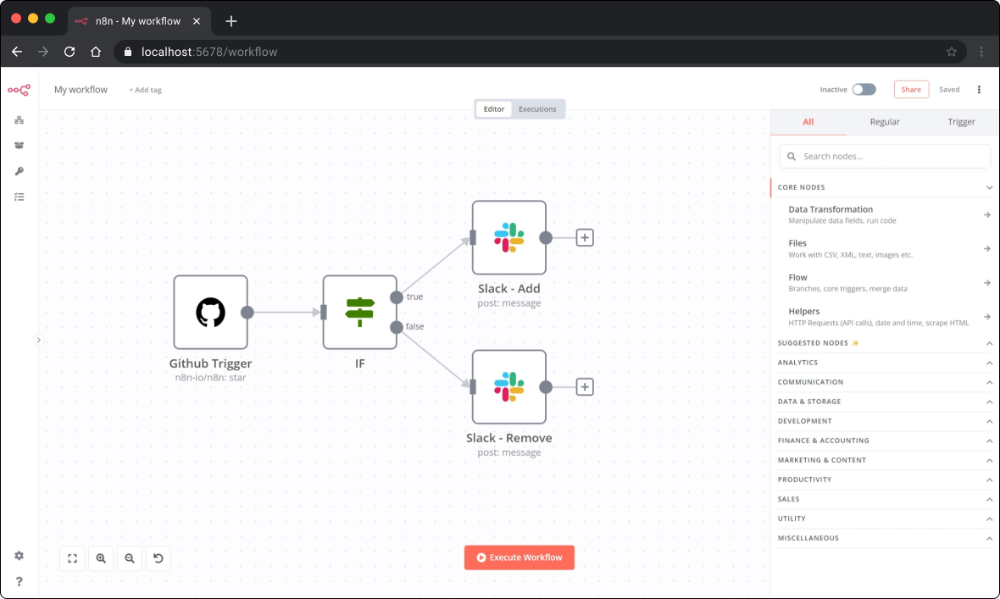

# n8n - Workflow automation tool

n8n is an extendable workflow automation tool. With a fair-code distribution model, n8n will always have visible source code, be available to self-host, and allow you to add your own custom functions, logic and apps. n8n's node-based approach makes it highly versatile, enabling you to connect anything to everything.



## update and upgrade

```bash
sudo apt update && sudo apt upgrade
```

## Install Docker compose

### Step 1 - Download docker compose

```bash
sudo curl -L "https://github.com/docker/compose/releases/download/1.29.2/docker-compose-$(uname -s)-$(uname -m)" -o /usr/local/bin/docker-compose
```

### Step 2 - Set the correct permissions

```bash
sudo chmod +x /usr/local/bin/docker-compose
```

### Step 3 - Verify that the installation was successful

```bash
docker-compose --version
```

You’ll see output similar to this:

```bash
Output
docker-compose version 1.29.2, build 5becea4c
```

## Start Configuration

### Step 1 - Clone repository GitHub

```bash
git clone https://github.com/Dkdaniz/n8n
```

### Step 2 - Change environment variables

**IMPORTANT**: But before you do that change the default users and passwords in the .env file!

```bash
cd n8n && cp .env.example .env
```

### Step 3 - Start Image

```bash
sudo docker compose up -d
```

### Step 4 - Access your n8n

Open your browser and access `https://YOUR-DOMAIN-DEFINED-IN-VARIABLE-ENV/`

## Stop Application

```bash
sudo docker-compose stop
```
